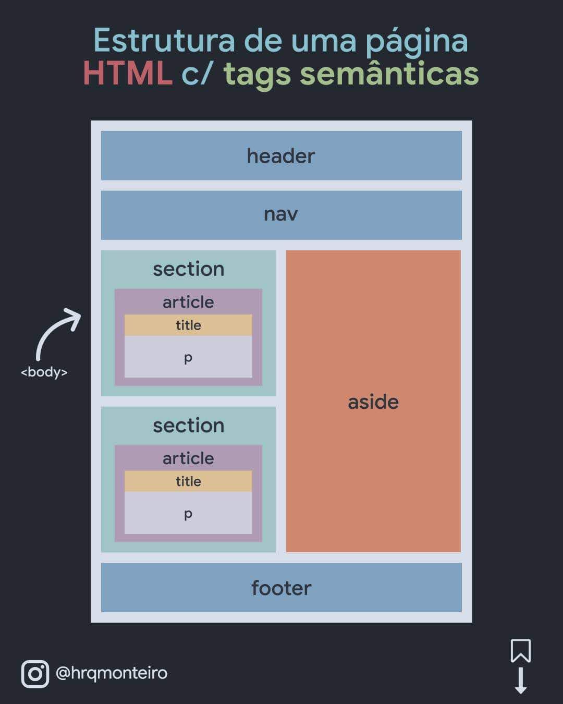

# Etapas de desenvolvimento do Site da IPEV

## Decidir quais as principais paginas

- Home
- Projetos
- Onde estamos

## Modelo de pagina

## Metas

- [ ] - Desenvolver o Html Semantico
- [ ] - Estilizar com CSS
- [ ] - Aplicar o Responsivo
